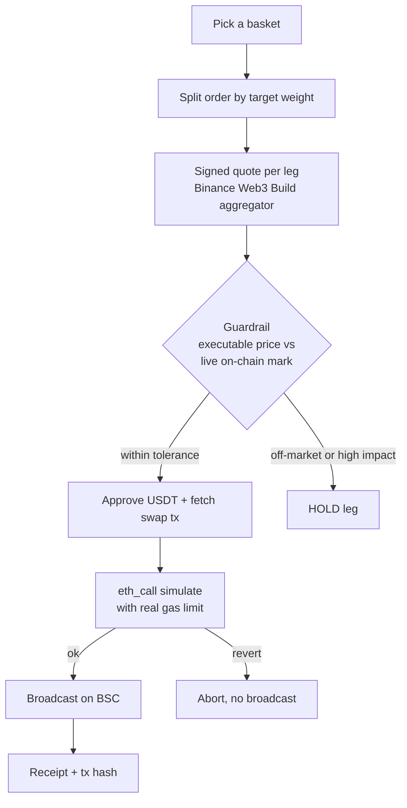
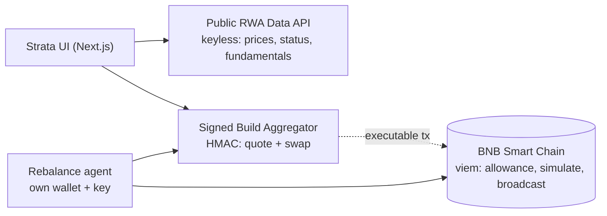

# Strata

**Buy a whole theme of tokenized stocks in one tap. Then hand it to an agent with its own wallet that keeps it balanced 24/7 on BNB Chain, and refuses any trade the market cannot fill honestly.**

[](https://strata-bnb.vercel.app)
[-F3BA2F?style=flat-square)](https://bscscan.com)
[](https://ondo.finance)
[](#)
[](#)

Strata is a tokenized-equity index product on BNB Smart Chain. You buy a curated, target-weighted basket of tokenized stocks (via **Ondo**, the live provider on Binance Web3) in a single approval, self-custodied. An on-chain **rebalancing agent** with its own wallet then keeps each basket on target around the clock, and its defining feature is a **liquidity guardrail**: it prices every route against the live on-chain mark and holds any leg the market cannot fill honestly, instead of letting a naive router burn the order.

---

## For judges: the 60-second version

| | |
|---|---|
| **Live product** | https://strata-bnb.vercel.app (quotes + guardrail run live from the hosted site) |
| **The edge** | A liquidity guardrail that **refuses off-market fills**. Proven in production: it held a real MSFTon route quoting at **~$1.03B/token vs a $511.52 mark** (see below). |
| **Real on-chain proof** | The agent's own wallet signed and broadcast **3 real BSC mainnet transactions**, including an actual tokenized-stock purchase (NVDAon). Hashes below, all on BscScan. |
| **Honesty** | The hosted demo is deliberately **simulate-only** (no key on the host, so it can never broadcast). The real execution path is proven by the mainnet hashes, run locally from a funded burner. We label every claim as live or roadmap. |
| **API depth** | Uses the public **RWA data API** (prices, fundamentals, market status) and the signed **Build aggregator** (quote + swap), gated by on-chain reads/writes via viem. |
| **Prizes targeted** | Best Use of Agentic Wallet, Best Use of BNB Agent Studio (plus the main pool). |

---

## Verifiable on-chain proof

The rebalancing agent holds **its own private key** and pays **its own gas**. These are real, autonomous transactions it signed and broadcast on BSC mainnet, not a connected user wallet:

| Action | Transaction |
|---|---|
| Agent buys **NVDAon** (tokenized NVIDIA, the money-shot) | [`0x9eb3e95b...fb477`](https://bscscan.com/tx/0x9eb3e95b72c781e536810167105c03167c32af40c63820cc272cabb29d9fb477) |
| Agent approves USDT (6) | [`0xfc15671b...ee6a`](https://bscscan.com/tx/0xfc15671bb95900c81800c3b87fd45c1457cb1dbdd3eb34c8b01ac0de8635ee6a) |
| Agent approves USDT (5) | [`0x3be3e991...e32e`](https://bscscan.com/tx/0x3be3e991f17b8b301619812990ddf5299aef7dae1f9277605e014ec2ec8ee32e) |

**Agent wallet:** [`0xD7F2ad868ae53de84F3666661Ce96592C6948C6B`](https://bscscan.com/address/0xD7F2ad868ae53de84F3666661Ce96592C6948C6B) (its own key, its own BNB for gas)

The NVDAon buy swapped ~5.2 USDT for ~0.0217 NVDAon through the Binance Web3 aggregator route, simulated with `eth_call` and then broadcast.

---

## The edge: it knows when *not* to trade

Tokenized-stock liquidity is intermittent. When no market maker is quoting a name, naive aggregator routes still return a fill, at an absurd synthetic price, and most agents take it. Strata prices every executable route against the live on-chain reference mark and **holds the leg** when the fill is a trap. The rest of the basket executes normally.

A real quote captured on BSC mainnet, MAG7 basket:

```
MSFTon      HELD
  Router would fill at   $1,030,453,124  per token
  Live on-chain price    $511.52         per token
  Deviation from mark    201,448,575%     (limit: 10%)
  -> No live RFQ maker at quote time. Held this leg, executed the other six.
```

This is the whole thesis in one frame: a router that trusts the quote burns the order; Strata does not. The guardrail runs on the hosted site right now (open a basket, "Get live quote," and watch one leg hold while the others go Ready).

---

## What is real vs simulated

We are precise about this because trust is the point.

**Real and live (verifiable):**
- Tokenized-stock baskets mapped to real Ondo tokens with real BSC contract addresses.
- Signed quotes from the Binance Web3 Build aggregator (HMAC-SHA256).
- Live reference prices and market status from the keyless RWA data API.
- The liquidity guardrail, holding off-market and high-impact routes (held MSFTon in production).
- An autonomous agent that signs and broadcasts real BSC mainnet transactions from its own wallet, including a real NVDAon purchase (hashes above).
- The agent pays its own gas from its own BNB balance.
- Simulate-by-default safety gate; a real broadcast requires both `AGENT_EXECUTION_MODE=live` and an explicit per-action go-ahead.
- Deployed and running on Vercel.

**Simulated or roadmap (labeled as such in the UI and here):**
- The full multi-leg autonomous rebalance runs in **simulate** mode in the hosted demo (quote, guardrail, preflight against the agent's own wallet, then it stops before signing). The single-leg live execution path is what the real hashes prove.
- **x402 self-funding** is roadmap. Today the agent funds gas from a pre-loaded BNB float; x402 is the planned path to full self-funding.
- **BNB Agent Studio** packaging is roadmap. Today the agent is a server-side executor (viem + the Binance aggregator) with its own identity and wallet; Agent Studio packaging is the next step.

---

## How it works



1. **Pick a theme.** Choose a basket like Magnificent 7 or AI Chips. Every holding is a tokenized equity you actually own.
2. **Buy in one tap.** Strata splits the order by target weight, quotes each leg through the aggregator, runs the guardrail, simulates, then broadcasts on BSC. One approval, one basket.
3. **The agent takes over.** An on-chain agent watches drift against your rule and rebalances only the legs the market can fill, 24/7, paying its own gas. You never leave self-custody.

---

## The baskets

Four curated themes, each a target-weighted set of real Ondo tokenized equities on BSC (chainId 56). Weights are honest product structure; prices and market status are read live at runtime.

| Code | Basket | Holdings |
|---|---|---|
| **MAG7** | Magnificent 7 | NVDA, AAPL, MSFT, GOOGL, AMZN, META, TSLA |
| **CHIPS** | AI Chips | NVDA, AVGO, AMD, TSM, ASML, MU |
| **OMAHA** | Buffett Portfolio | AAPL, AXP, BAC, KO, CVX, OXY |
| **CLOUD** | Cloud & Software | MSFT, ORCL, CRM, NOW, ADBE, SNOW |

On-chain symbols use Ondo's `on` suffix (AAPL -> AAPLon). The shares multiplier (1 token = N shares, which drifts as dividends accrue) is never hardcoded; it is read live per price query.

---

## Architecture

Two Binance surfaces, split by job, plus direct chain access for custody and settlement.



- **Public RWA data API** (`www.binance.com/bapi/defi`, keyless): the Ondo token universe on BSC, per-token price and fundamentals, market and asset status. This is the display layer and the guardrail's reference price. Success envelope uses a string `code`.
- **Signed Build aggregator** (`web3.binance.com/build`, HMAC-SHA256): `dex/aggregator/quote` for routes and `dex/aggregator/swap` for the executable transaction. The chain param is `binanceChainId`; Ondo quotes are wallet-bound (RFQ), so a wallet address is supplied at quote time.
- **On-chain layer** (viem over public BSC RPC, with a 5-endpoint fallback): ERC-20 allowance and balance reads, `eth_call` simulation, and broadcast from the agent's own wallet.

### Safety model

The agent can broadcast, so it is gated deliberately:

- `AGENT_EXECUTION_MODE=simulate` (the default) performs quote, guardrail, and preflight, then **stops before any signature**. Zero authorizations.
- Live broadcast requires **both** `AGENT_EXECUTION_MODE=live` **and** an explicit per-call `goAhead`. There is no silent broadcast path.
- The hosted deployment has **no private key**, so it is permanently simulate-only.

### Binance Web3 API coverage

The tie-break is depth of Binance Web3 usage. Strata calls two modules, and uses them deeply; balances, simulation, and settlement are done directly on-chain with viem.

| Binance Web3 module | How Strata uses it |
|---|---|
| **RWA Data API** | Keyless feed: the Ondo tokenized-equity list on BSC, per-token price and fundamentals, market and asset status. This is the display layer and the guardrail's reference mark. |
| **Trading API** | Signed (HMAC-SHA256) aggregator: `dex/aggregator/quote` for per-leg routes, `dex/aggregator/swap` for the executable transaction. |

Everything else is deliberately our own: balances, allowance, `eth_call` simulation, and broadcast run on BSC directly (viem over public RPC), and the wallet connect is an injected EIP-1193 provider.

---

## Run it locally

Requires Node 20+.

```bash
git clone https://github.com/Sketchify-Dev/strata-bnb.git
cd strata-bnb
npm install
cp .env.example .env.local   # optional, see below
npm run dev                  # http://localhost:3000
```

**It runs with zero credentials.** With no keys, the signed API falls back to a deterministic mock, and the Ondo RWA price feed is keyless and stays live, so the full UI and quote flow work out of the box.

For **live signed quotes**, add your Binance Web3 Build API key and secret to `.env.local`:

```
BINANCE_WEB3_API_KEY=...
BINANCE_WEB3_SECRET_KEY=...
```

For **live on-chain execution** (optional, broadcasts real transactions), add a brand-new funded **burner** key and flip the mode. Never use your main wallet, and read `docs/agent-wallet.md` first:

```
AGENT_WALLET_PRIVATE_KEY=0x...     # a fresh burner, small float only
AGENT_EXECUTION_MODE=live          # still needs a per-action go-ahead
```

> **Network note:** Binance endpoints are geoblocked in some regions and from US IPs. The hosted demo runs its functions from Frankfurt to reach them. Locally, a non-US network path may be required. See `docs/DEPLOY.md`.

Standalone execution scripts (no dev server needed) live in `scripts/`: `agent-approve.mjs` and `agent-buy.mjs` are what produced the real hashes above.

---

## Project structure

```
app/                     Next.js App Router
  page.tsx               Landing (story, the edge, baskets)
  app/                   The product (baskets, portfolio, agent console)
  api/binance/quote      Server-signed basket quote + guardrail
  api/agent/execute      Agent execution (simulate / live)
lib/
  baskets.ts             The four baskets, real Ondo BSC addresses
  binance/               RWA data client, signed aggregator, quote-basket guardrail, mock
  chain/                 viem BSC clients, ERC-20 helpers
  agent/                 executor, preflight, exec-config, rebalance planner
components/              UI (basket cards, buy panel, agent console)
scripts/                 Standalone probes and the real approve/buy runners
docs/                    Agent wallet setup, deploy guide, demo script
```

---

## Roadmap

- **x402 self-funding** so the agent tops up its own gas with no pre-funded float.
- **BNB Agent Studio** packaging for a first-class agent identity and runtime.
- **Multi-leg live rebalance** end to end (the pipeline is built and simulated today).
- Rate-limiting on the public quote endpoint for production.

---

## Built for

BNB Hack: Tokenized Stocks Edition (BNB Chain + Binance Web3 Wallet). Spot only. BSC mainnet. Tokenized stocks via Ondo.

Built by [@Sketchify-Dev](https://github.com/Sketchify-Dev).

*Not investment advice. Strata is a hackathon project; tokenized equities carry risk and availability varies by jurisdiction.*
